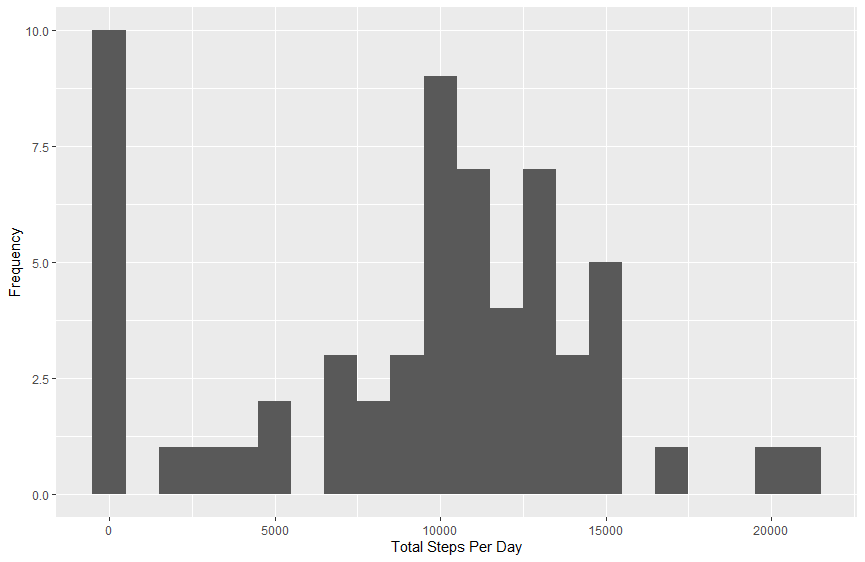
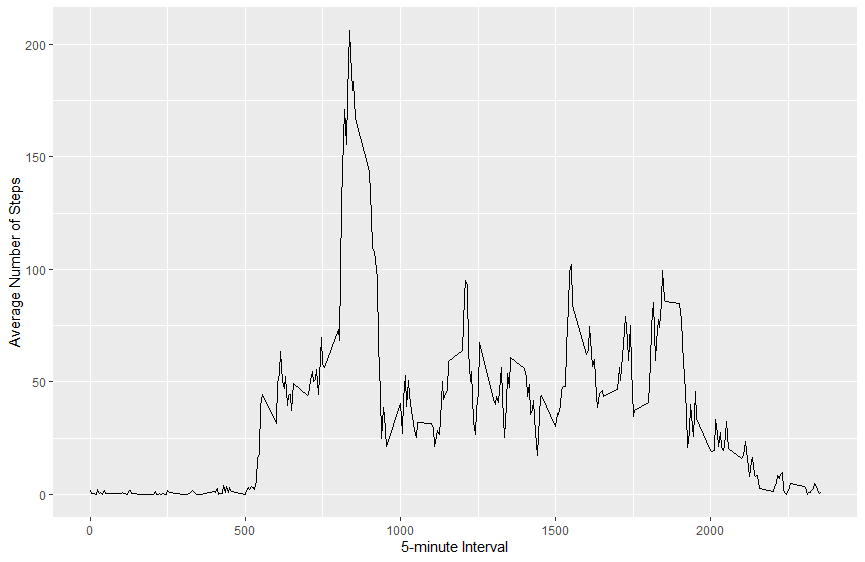
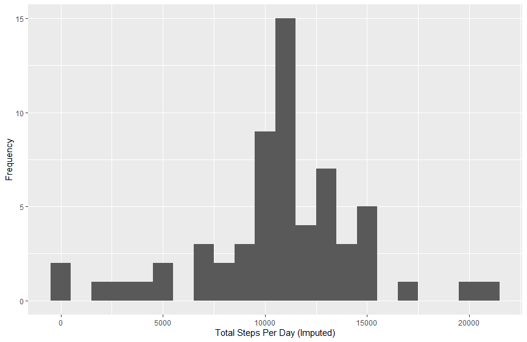
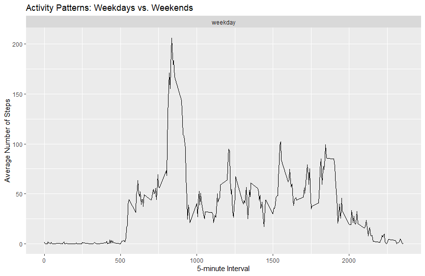

# Loading and preprocessing the data

### Load necessary libraries

```r
library(ggplot2)
library(dplyr)
```

### Load the data

```r
data <- read.csv("activity.csv")
```


# What is mean total number of steps taken per day?

### Calculate total number of steps taken per day

```r
daily_steps <- data %>%
  group_by(date) %>%
  summarize(total_steps = sum(steps, na.rm = TRUE))
```

### Histogram of the total number of steps taken each day

```r
ggplot(daily_steps, aes(x = total_steps)) +
  geom_histogram(binwidth = 1000) +
  xlab("Total Steps Per Day") +
  ylab("Frequency")
```

### Calculate and report the mean and median

```r
mean_steps <- mean(daily_steps$total_steps)
median_steps <- median(daily_steps$total_steps)
```

<div>

</div>

# 

# What is the average daily activity pattern?

### Time series plot of the average number of steps taken

```r
average_steps <- data %>%
  group_by(interval) %>%
  summarize(mean_steps = mean(steps, na.rm = TRUE))
```

```r
ggplot(average_steps, aes(x = interval, y = mean_steps)) +
  geom_line() +
  xlab("5-minute Interval") +
  ylab("Average Number of Steps")
```

### Find the interval with the maximum number of steps

max_interval <- average_steps[which.max(average_steps$mean_steps), ]$interval

<div>

</div>


# Imputing missing values

### Total number of missing values

```r
missing_values <- sum(is.na(data$steps))
```

### Strategy for filling in missing values (using mean for that 5-minute interval)

```r
imputed_steps <- transform(data, steps = ifelse(is.na(data$steps), average_steps$mean_steps[match(data$interval, average_steps$interval)], data$steps))
```

### Repeat the histogram and mean/median calculations with the new dataset

```r
imputed_daily_steps <- imputed_steps %>%
  group_by(date) %>%
  summarize(total_steps = sum(steps))
```

```r
ggplot(imputed_daily_steps, aes(x = total_steps)) +
  geom_histogram(binwidth = 1000) +
  xlab("Total Steps Per Day (Imputed)") +
  ylab("Frequency")
```

```r
mean_imputed <- mean(imputed_daily_steps$total_steps)
median_imputed <- median(imputed_daily_steps$total_steps)
```

<div>

</div>

# 

# Are there differences in activity patterns between weekdays and weekends?

### Create a new factor variable

```r
imputed_steps$date <- as.Date(imputed_steps$date)
imputed_steps$day_type <- ifelse(weekdays(imputed_steps$date) %in% c("Saturday", "Sunday"), "weekend", "weekday")
```

### Time series plot

```r
average_steps_day_type <- imputed_steps %>%
  group_by(interval, day_type) %>%
  summarize(mean_steps = mean(steps))
```

```r
ggplot(average_steps_day_type, aes(x = interval, y = mean_steps)) +
  geom_line() +
```

```r
facet_wrap(~day_type, ncol = 1, nrow = 2) +
  xlab("5-minute Interval") +
  ylab("Average Number of Steps") +
  labs(title = "Activity Patterns: Weekdays vs. Weekends")
```

<div>

</div>
